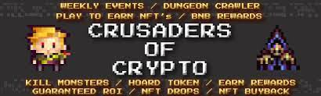

			
				HTML
				
					
				
				
						
				
			
		Crusaders of Crypto 是币安智能链上的 Rogue-like/Dungeon Crawler 游戏！

  玩家可以钻研随机生成的地下城，并掠夺专属的 NFT！
  Crusaders of crypto 具有多种赚取收入的元素，包括 NFT 市场，以及创新的“NFT 回购”系统，该系统可以为 BNB 从玩家手中购买不需要的地牢战利品！
  该游戏还具有每周有奖活动、异步玩家对玩家模式以及仅持有 CRUSADER 代币的 BNB 反射！xxxxxxxxxx 
Crusaders of Crypto is a Rogue-like/Dungeon Crawler game on the Binance Smart Chain!
<ul>  <li>Players are able to delve randomly generated dungeons, and loot exclusive NFT!</li>  <li>Crusaders of crypto features multiple play-to-earn elements, including an NFT marketplace, as well as an innovative "NFT Buyback" system that buys unwanted dungeon loot off of players for BNB!</li>  <li>The game also features weekly events with prizes, an asynchronous player-versus-player mode, as well as BNB reflection from just holding the CRUSADER token!</li></ulCrusaders of Crypto is a Rogue-like/Dungeon Crawler game on the Binance Smart Chain!

  Players are able to delve randomly generated dungeons, and loot exclusive NFT!
  Crusaders of crypto features multiple play-to-earn elements, including an NFT marketplace, as well as an innovative "NFT Buyback" system that buys unwanted dungeon loot off of players for BNB!
  The game also features weekly events with prizes, an asynchronous player-versus-player mode, as well as BNB reflection from just holding the CRUSADER token!

