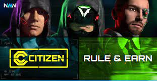

			
				HTML
				
					
				
				
						
				
			
		HTML

Crypto Citizen 在 NFT Metaverse 中引入了玩和赢游戏的新时代。将你的命运设定在 2101 年即将发生技术革命的大都会！ Crypto Citizen的MMO世界可让您充分实现梦想。建立一个有利可图的企业，建立你的工厂，驾驶最热门的汽车或参观最赚钱的俱乐部。
所有这一切都在一个开放的世界 Metaverse 中进行，无论您是打算亲身体验还是享受资本主义的奢华。利用模块化构建系统，在加密货币世界的货币化领域将您的想法变为现实。
尊重是赢得的，而不是给予的。利用独特的奖励系统，让自己登上公民排名榜首！要么拥有专属市民ID，要么通过CCASH前所未见的游戏经济模式治理城市，加入贵族，带你进入大都会的贵族。 CCASH 代表了一种管理大都会的手段。如果您打算合法地保护它，这是您的选择。xxxxxxxxxx 
Crypto Citizen introduces a new era of play &amp; earn gaming in NFT Metaverse. Set your destiny in the Metropolit city taking place in the year 2101 on the verge of technological revolution! MMO world of Crypto Citizen allows you to live your dreams to the fullest. Establish a profitable business, build your factories, ride the hottest cars or visit the most lucrative clubs.

All of that in an open world Metaverse, whether you plan to get your hands dirty or enjoy the luxury of capitalism. Take the advantage of a modular building system and transform your ideas into reality in a monetized sphere of the cryptocurrency world.

Respect is earned, not given. Take advantage of the unique reward system and get yourself to the top of citizen rankings! Join the nobles either by owning the exclusive citizen ID or by governing the city through the never-seen-before game economics model of CCASH, which brings you to the aristocracy of Metropolit city. CCASH represents a means to govern the Metropolit. It's your choice if you plan to secure it legally, or not.
Crypto Citizen introduces a new era of play & earn gaming in NFT Metaverse. Set your destiny in the Metropolit city taking place in the year 2101 on the verge of technological revolution! MMO world of Crypto Citizen allows you to live your dreams to the fullest. Establish a profitable business, build your factories, ride the hottest cars or visit the most lucrative clubs.
All of that in an open world Metaverse, whether you plan to get your hands dirty or enjoy the luxury of capitalism. Take the advantage of a modular building system and transform your ideas into reality in a monetized sphere of the cryptocurrency world.
Respect is earned, not given. Take advantage of the unique reward system and get yourself to the top of citizen rankings! Join the nobles either by owning the exclusive citizen ID or by governing the city through the never-seen-before game economics model of CCASH, which brings you to the aristocracy of Metropolit city. CCASH represents a means to govern the Metropolit. It's your choice if you plan to secure it legally, or not.

