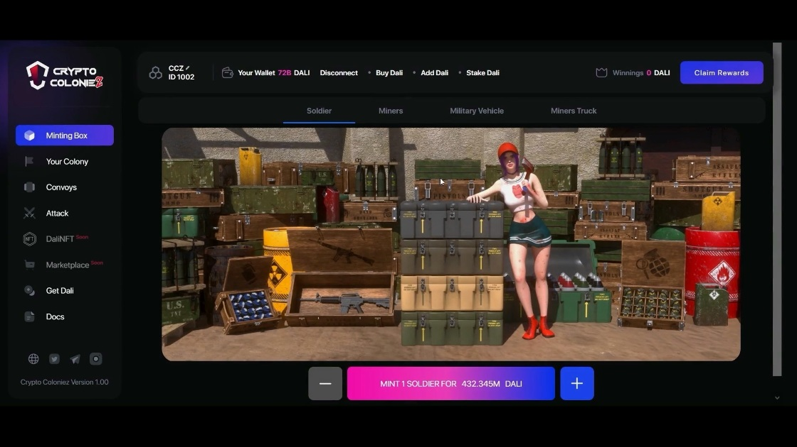

			
				HTML
				
					
				
				
						
				
			
		Crypto Coloniez 是一款赚钱的 NFT 游戏，背景设置在世界末日后的世界中，成千上万的小行星以强大的再生水晶撞击地球。没有城市也没有国家，只有幸存者的殖民地！这些水晶拥有强大的回春能力，可以让地底深处的亡灵复活，并为那些在巨大冲击中幸存下来的人，获得永生！ ColonieZ 需要开采这些水晶才能生存，但在每个受水晶影响的 ColonieZ 中，您都必须面对保护他们生命之源的僵尸！

