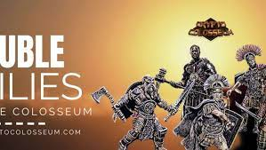

			
				HTML
				
					
				
				
						
				
			
		CryptoColosseum 是一款分层游戏。我们称之为“堕落赌博和异想天开的暴力的加密游戏”。角斗士 (NFT) 在竞技场中战斗。上手容易，但精通难。这是一个期望价值、现金流、市场和收集的游戏。
角斗士属于派系（BTC、ETH、MATIC），这些资产的价格变动会影响结果。玩家购买可以帮助角斗士或伤害敌人的物品。角斗士赢得一定比例的奖池，派系也赢得角斗士的部分。
你最终会得到一个游戏，你可以通过投注你喜欢的角斗士来开始......然后，如果你愿意，你可以真正深入了解加密经济学和市场力量......从收益一路走来一代到治理。
这只是游戏玩法。物品是 NFT，有些非常具有收藏价值。角斗士本身就是 NFT，它们提供了不同于其他纯收藏品的独特特征。
来自@OpenAI 的 GPT3 增强了一切，它产生了奇怪而聪明的背景故事，使战斗充满活力：“Dentalion 将长矛深入 Vang Diesel 的胸部，就在心脏下方。Vang Diesel 无法逃脱，他仰面倒地。 "xxxxxxxxxx 
CryptoColosseum is a layered game. We call it "a crypto game of degenerate gambling and whimsical violence." Gladiators (NFTs) fight in the arena. It's easy to get started, but difficult to master. It's a game of expected value, cash flow, markets and collecting.

Gladiators belong to factions (BTC, ETH, MATIC) and the price movement of those assets effects the outcome. Players buy items which help their gladiators or hurt their foes. Gladiators win a percentage of the prize pool and factions win pieces of the gladiators take too.

You end up with a game that you can get started by just betting on a gladiator you like... and then, if you want, you can get really deep into the crypto-economics and market forces... all the way from yield generation to governance.&nbsp;

And that's just the game play. Items are NFTs and some will be very collectible. The gladiators themselves are NFTs and they offer unique characteristics that differ from other pure collectibles.&nbsp;

Everything is enhanced by GPT3 from @OpenAI which generates weird and clever backstories and makes the battles energetic: &nbsp;"Dentalion thrusts the spear deep into Vang Diesel's chest, right below the heart. Vang Diesel can't get away and he falls on his back."</pCryptoColosseum is a layered game. We call it "a crypto game of degenerate gambling and whimsical violence." Gladiators (NFTs) fight in the arena. It's easy to get started, but difficult to master. It's a game of expected value, cash flow, markets and collecting.
Gladiators belong to factions (BTC, ETH, MATIC) and the price movement of those assets effects the outcome. Players buy items which help their gladiators or hurt their foes. Gladiators win a percentage of the prize pool and factions win pieces of the gladiators take too.
You end up with a game that you can get started by just betting on a gladiator you like... and then, if you want, you can get really deep into the crypto-economics and market forces... all the way from yield generation to governance. 
And that's just the game play. Items are NFTs and some will be very collectible. The gladiators themselves are NFTs and they offer unique characteristics that differ from other pure collectibles. 
Everything is enhanced by GPT3 from @OpenAI which generates weird and clever backstories and makes the battles energetic:  "Dentalion thrusts the spear deep into Vang Diesel's chest, right below the heart. Vang Diesel can't get away and he falls on his back."

