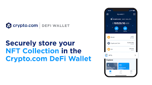

			
				HTML
				
					
				
				
						
				
			
		HTML

直接从您的 DeFi 钱包中种植和交换 DeFi 代币的最佳场所 流动性提供者享受选定矿池的交换费分享和红利收益
一个非托管钱包，可让您在一个地方访问一整套 DeFi 服务。
店铺
完全控制您的加密货币和密钥轻松管理 100 多种硬币，包括 BTC、ETH、CRO、ATOM、DOT、LTC 和其他 ERC20 代币使用 12/18/24 字的恢复短语轻松导入现有钱包
发送
以您喜欢的确认速度和网络费用发送加密货币
赚
通过 Yearn Earn V2、Compound、Aave、Crypto.org Chain Staking 和 Cosmos Staking 赚取超过 35 种代币的利息 无锁定期和丰厚回报
交换xxxxxxxxxx 
The best place to farm and swap DeFi tokens, directly from your DeFi Wallet &nbsp;Liquidity Providers enjoy Swap-fee Sharing and Bonus Yield for selected pools

A non-custodial wallet that gives you access to a full suite of DeFi services in one place.

<strong>Store</strong>

Full control of your cryptos and your keys &nbsp;Easily manage 100+ coins, including BTC, ETH, CRO, ATOM, DOT, LTC, and other ERC20 tokens &nbsp;Easily import your existing wallet with a 12/18/24-word recovery phrase

<strong>Send</strong>

Send crypto at your preferred confirmation speed and network fee

<strong>Earn</strong>

Earn interest on 35+ tokens with Yearn Earn V2, Compound, Aave, Crypto.org Chain Staking, and Cosmos Staking &nbsp;No lock-up term and great returns

<strong>Swap</strong>

<strong>&nbsp;</strong>
The best place to farm and swap DeFi tokens, directly from your DeFi Wallet  Liquidity Providers enjoy Swap-fee Sharing and Bonus Yield for selected pools
A non-custodial wallet that gives you access to a full suite of DeFi services in one place.
Store
Full control of your cryptos and your keys  Easily manage 100+ coins, including BTC, ETH, CRO, ATOM, DOT, LTC, and other ERC20 tokens  Easily import your existing wallet with a 12/18/24-word recovery phrase
Send
Send crypto at your preferred confirmation speed and network fee
Earn
Earn interest on 35+ tokens with Yearn Earn V2, Compound, Aave, Crypto.org Chain Staking, and Cosmos Staking  No lock-up term and great returns
Swap
 

