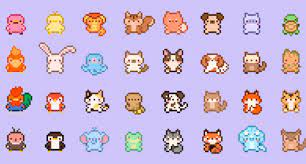

			
				HTML
				
					
				
				
						
				
			
		CryptoCompanions 是 Avalanche Network 上的一款以游戏为收入的区块链 PVP NFT 游戏，以可升级的生物为中心，称为 Companions 及其复合对应物：战斗图腾。
您可以在战斗图腾上召唤至少 3 个同伴进行 PVP 战斗，并通过赢得战斗和锦标赛来获得奖励，以获得代币奖励；这些奖励包括 AVAX！事实证明，战斗是公平的，因为 Chainlink VRF 保护了它们。xxxxxxxxxx 
CryptoCompanions is a play-to-earn blockchain PVP NFT game on the Avalanche Network centered around upgradeable creatures known as Companions and their composite counterparts: battle totems.

You can play PVP Battles Summoning at least 3 of your Companions on Battle Totems and earn rewards by winning battles and tournaments to earn token rewards; these rewards include AVAX! Battles are provably fair, as the Chainlink VRF secures them.</pCryptoCompanions is a play-to-earn blockchain PVP NFT game on the Avalanche Network centered around upgradeable creatures known as Companions and their composite counterparts: battle totems.
You can play PVP Battles Summoning at least 3 of your Companions on Battle Totems and earn rewards by winning battles and tournaments to earn token rewards; these rewards include AVAX! Battles are provably fair, as the Chainlink VRF secures them.

