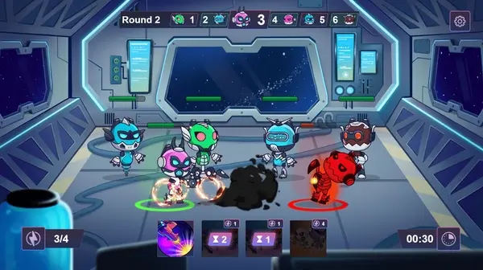

			
				HTML
				
					
				
				
						
				
			
		CryptoBots 是第一款以经济为中心的 p2e 游戏，融合了两种类型——收藏 RPG 和太空大战略。基于代币效用、质押、销毁和收益方面的颠覆性创新。
游戏玩法：
3x3 PVP 竞技场战斗
机器人制造
宇宙飞船大战
宇宙飞船制造
搜索和探索任务
NFT 土地
联盟
市场
租金和奖学金
项目背景：
来自 Playneta 的创始人——一个拥有超过 1 亿安装量的游戏工作室
很深的游戏经济
预售结束，目前 90% 以上的 Bot 已被质押
完全doxed团队

