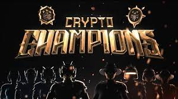

Crypto Champions 是一款独特的套牌构建类流氓策略游戏。从 15 张牌开始，在 PvE 或 PvP 格式的竞技场中战斗时构建你的套牌。 Crypto Champions 在以太坊上运行，每张稀有卡片和冠军物品都以 ERC-721 代币的形式提供。目前提供限量版卡片的创世纪套牌可用，很快免费的入门套牌和设备将可用。最终，我们将提供锦标赛以及季节性奖池。

Crypto Champions 是 8,888 个独特的 NFT 字符的集合。每个冠军都是准备在即将到来的元战争中战斗的原始属性组合。该系列以卓越和超逼真的 3D 人类士兵艺术品为特色，并为持有者提供了首创的实用工具。

