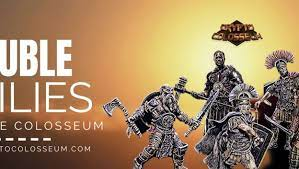

CryptoColosseum 是一款分层游戏。我们称之为“堕落赌博和异想天开的暴力的加密游戏”。角斗士 (NFT) 在竞技场中战斗。上手容易，但精通难。这是一个期望价值、现金流、市场和收集的游戏。

角斗士属于派系（BTC、ETH、MATIC），这些资产的价格变动会影响结果。玩家购买可以帮助角斗士或伤害敌人的物品。角斗士赢得一定比例的奖池，派系也赢得角斗士的部分。

你最终会得到一个游戏，你可以通过投注你喜欢的角斗士来开始......然后，如果你愿意，你可以真正深入了解加密经济学和市场力量......从收益一路走来一代到治理。&nbsp;

这只是游戏玩法。物品是 NFT，有些非常具有收藏价值。角斗士本身就是 NFT，它们提供了不同于其他纯收藏品的独特特征。&nbsp;

来自@OpenAI 的 GPT3 增强了一切，它产生了奇怪而聪明的背景故事，使战斗充满活力：&nbsp;“Dentalion 将长矛深入 Vang Diesel 的胸部，就在心脏下方。Vang Diesel 无法逃脱，他倒在了他的身上背部。”

