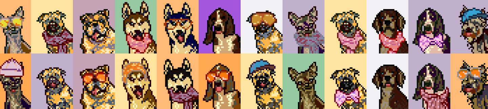

<strong>加密狗 NFT</strong>

加密狗是 10,000 个程序设计的 gif 格式的 NFT，由一流的艺术家制作可爱的动画，它们可以通过燃烧 Doggy 代币来铸造。每个 NFT 都是独一无二的，具有狗品种、颜色或配件等壮观特征。

<strong>吠叫声 NFT</strong>

吠 NFT 是 10,000 种独特的吠叫声音，每个都有一个卡通狗吠动画视频，由 BakerySwap 的 NFT 艺术社区的专业艺术家创作。这 10,000 种独特的声音很特别，因为它们是同类中的第一个。

