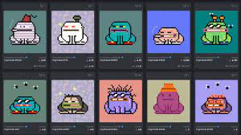

CrypToadz 是小型两栖动物，它们在以前称为 Uniswamp 的沼泽盆地中漫游。不幸的是，大约六周前，邪恶之王 Gremplin 降临 Uniswamp 并派出 CrypToadz 首领弗洛宾上校，将他流放到古奇岛。在 Floorbin 上校倒台后，邪恶的国王 Gremplin 宣布了他统治 Metaverse 中所有 CrypToadz 的神圣权利。魔王格伦普林的第一个命令是将 Uniswamp 重命名为 GREMPLAND。邪恶之王 Gremplin 和他的 Fronkz 军队统治着 CrypToadz。众所周知，Toadz 将邪恶国王 Gremplin 的统治称为“CROAKENING”。通过选择在铸币期间释放的数量，帮助 Toadz 摆脱邪恶国王 Gremplin 的统治。

