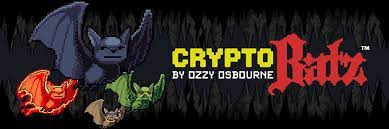

CRYPTOBATZ 是 9,666 个区块链住宅蝙蝠的集合，由 OZZY OSBOURNE 创造性地指导，并由被称为 SUTTER SYSTEMS 的 NFT 痴迷的书呆子团队建造。

CRYPTOBATZ 有机会拥有一件由我们一生中最传奇的摇滚偶像之一创作的完全独特的收藏艺术品。

我们希望 CRYPTOBATZ 做一些新的事情，一些不容易的事情，一些我们以前从未见过的事情。每个 CRYPTOBAT 都具有创新能力……能够从不同的蓝筹项目中“咬”一个 NFT，并创建一个共享两种代币 DNA 的“Mutantbat”。

每个 CRYPTOBAT 都只能咬一次，所以请谨慎选择，因为您选择咬的内容将决定您创建哪个 MUTANTBAT。

要从精选的蓝筹“受害者”项目中受益，您必须将 CRYPTOBAT 和受害者都放在同一个钱包中。 BITING UTILITY 将在公开发行后不久开放（具体日期待定）。

以下是您的 CRYPTOBATZ 将能够“咬”的“受害者项目”列表：

