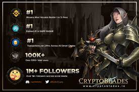

<strong>2021 年 5 月推出的首屈一指的 NFT 制作、玩赚游戏</strong>

CryptoBlades 是由 Riveted 游戏开发的以游戏为目的的 NFT 角色扮演游戏。游戏围绕着获得传说中的刀片和使用它们的强大英雄展开。玩家可以使用他们的资产参与战斗以获得 SKILL 代币。 &nbsp;资产是按照 ERC-721 标准铸造的玩家拥有的 NFT，可以在专有市场上交易。 CryptoBlades 通过游戏分配 SKILL 并通过未来功能增加其使用来为玩家 NFT 赋予价值，从而利用了一种赚取收入的模式。

