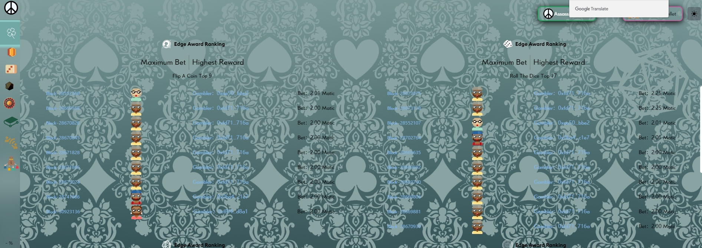

Dice4Utopia 是 Dao2Utopia 的产品之一。任何通过 IDO 投资 Dice4Utopia 的刺客（持有 Dao2Utopia 的股份代币<strong>刺客信条</strong>）都是 Dice4Utopia 的股东，并持有该产品的股份。有了这个份额和 ACreed，你将有一个完全自由且不受影响的选择👉，<strong>在游戏成长之前拿走 10% 的游戏收入</strong>，或者在完成之后拿走所有游戏资产的 15%游戏成长

