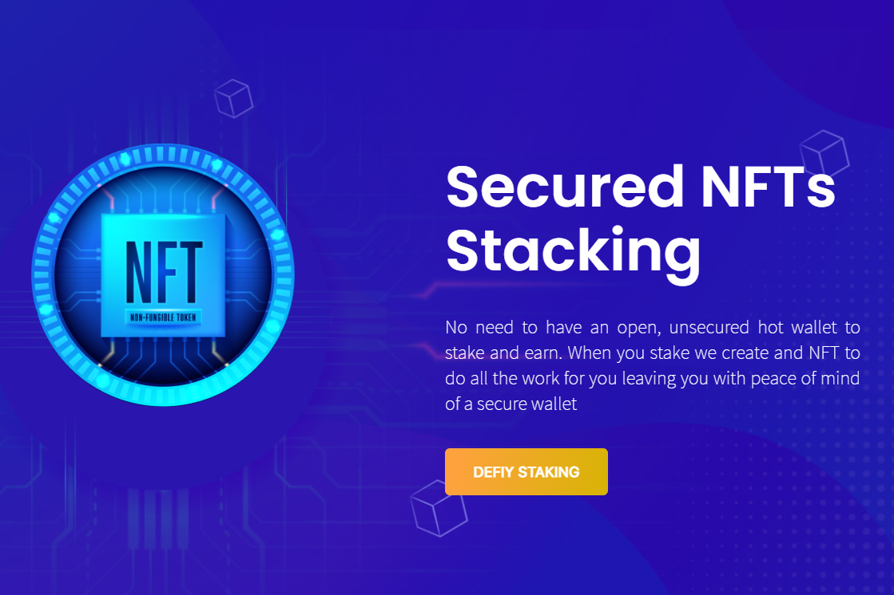

---
title: "DeFiFarms NFTs"
description: "DeFiFarms - 币安智能链上带有收益农业 NFT 的全栈 DEFI"
date: 2022-08-16T00:00:00+08:00
lastmod: 2022-08-16T00:00:00+08:00
draft: false
authors: ["boogArno"]
featuredImage: "defifarms-nfts.png"
tags: ["DeFi","DeFiFarms NFTs"]
categories: ["nfts"]
nfts: ["DeFi"]
blockchain: "BSC"
website: "https://defifarms.org/"
twitter: "https://twitter.com/DeFiFarmsNFTs"
discord: ""
telegram: "https://t.me/DeFiFarmsNFT"
github: "https://github.com/defifarms"
youtube: "https://www.youtube.com/channel/UCT-rEX3jrrYYCmGGwX_X-Bg"
twitch: ""
facebook: ""
instagram: "https://www.instagram.com/defifarms_nfts/"
reddit: ""
medium: "https://defifarmsnfts.medium.com/"
steam: ""
gitbook: ""https://www.reddit.com/r/DeFiFarms/
googleplay: ""
appstore: ""
status: "Live"
weight: 
lightgallery: true
toc: true
pinned: false
recommend: false
recommend1: false
---
DeFiFarms Non-Fungible Yearn – BSC DefiFarms Non-Fungible Yearn 或 DEFIY 上的 DeFi 平台是一种 DeFi NFT 协议，用于在币安智能链上使用 ERC-721 代币进行收益农业。通过使用 NFT 代币，DefiFarms 可以让赌注变得更加动态！与其将权益绑定到用户的钱包地址，不如将其与可转让的 NFT 相关联。使用 DEFIY，您最喜欢的收藏品也可以为您赚钱