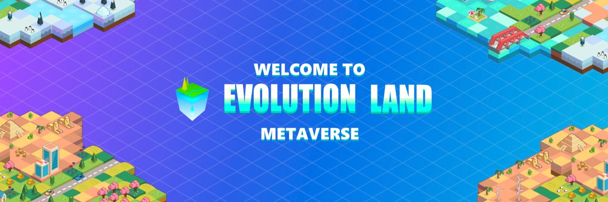

Evolution Land是一款基于区块链的虚拟经营游戏。玩家可以在采矿、建筑、PvP、科学研究等活动中一起工作或互相对抗，以在他们的基于区块链的资产中获得乐趣并增加财富。

亚特兰蒂斯大陆是地球生命进化之地的第一处，也是生命开始的地方。这片大陆的资源与地球相似。它们由金、木、水、火和硅组成。这些元素在广袤的大陆上分布不均。他们还隐藏了一些只有进化地才有的宝箱和宝物资源。

探索与综合，是进化之地的生存法则。拥有土地的玩家可以通过开采私人领地来获取资源。还可以利用不同资源之间的特殊关系，合成出奇妙的物质。这一切都在等待新生命的发现……

