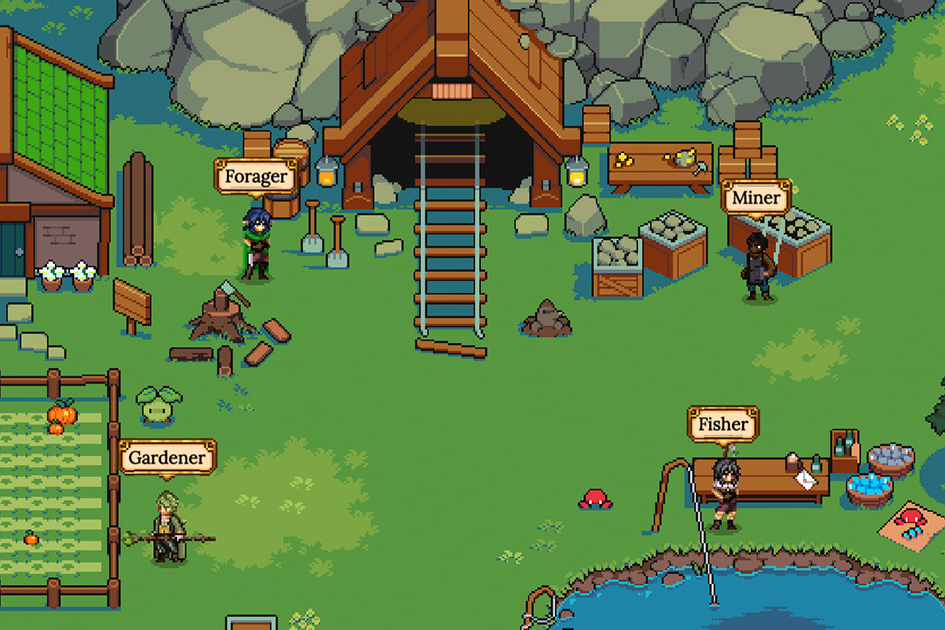

JEWEL 代币用于购买有用的物品和独特的 NFT，例如游戏中的英雄和王国，以及各种游戏内物品。代币不仅在游戏中使用，还用于流动性挖矿，通过质押获得更多收益。 JEWEL 也是一种治理代币，因此持有者将在项目的发展和演变中拥有发言权。
接下来的阶段将发布 Collectable Hero NFTs 以及多个实用案例（包括 PvP 和 PvE，以及提前解锁矿池奖励），并释放有限供应的可开发和使用的土地资源收集和 NFT 设备制作。

