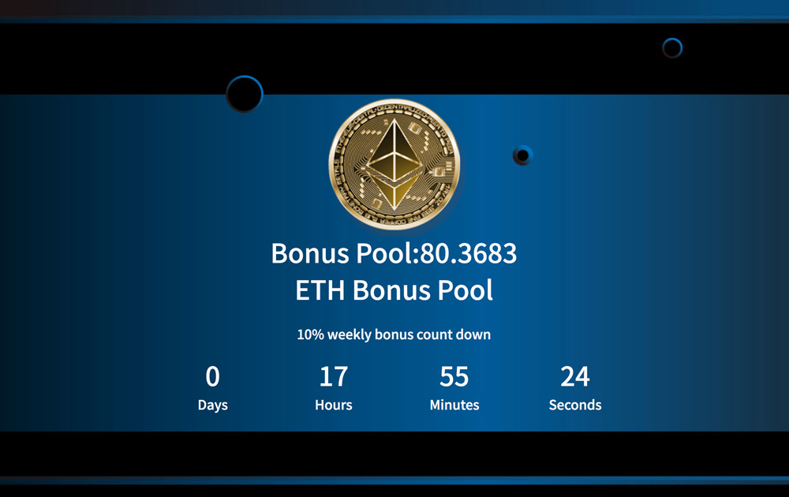

Ethfish Ethfish 是基于以太坊区块链的水产养殖游戏。通过以太坊购买、捕鱼、捕鱼、繁殖和繁殖鱼，你可以通过出售你的鱼来赚取真正的以太坊！！成为每周比赛奖品或头奖的赢家。更多的鱼你得到更多的回报作为回报。今天加入我们！以太鱼以太鱼是某种区块链上的养殖型去以太坊区块链游戏，也就是区块链以太坊区块链中心化应用（dEthereum）主要在区块链上运行的智能合约，其使用以太坊购买、渔场、养殖、增值！最后以太鱼来直接获得以太币！本通过智能合约宣传游戏规则在区块链上，因此游戏规则有所改变。除了鱼外收入，全新不用奖金池机制，每周都得主可以独得收益池10%。写出多鱼收获越多，立即加入。

